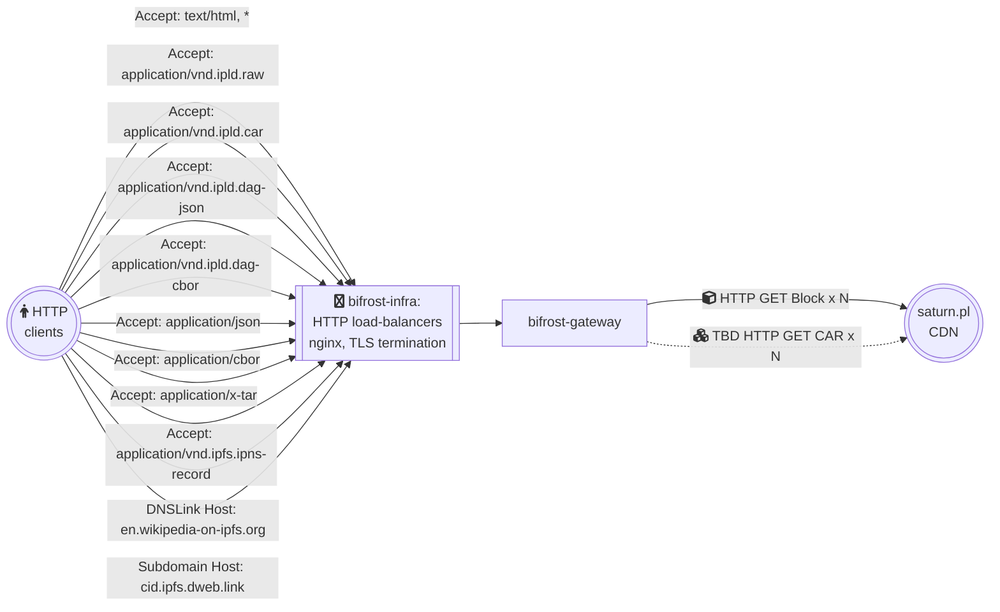

bifrost-gateway
=======================

> A lightweight IPFS Gateway daemon backed by a remote data store. 

- [About](#about)
- [Usage](#usage)
  - [Local build](#local-build)
  - [Configuration](#configuration)
  - [Docker](#docker)
- [FAQ](#faq)
  - [How to run with local gateway](#how-to-run-with-local-gateway)
  - [How to run with Saturn CDN backend](#how-to-run-with-saturn-cdn-backend)
  - [How to debug](#how-to-debug)
  - [How does this work at ipfs.io and dweb.link](#how-does-this-work-at-ipfsio-and-dweblink)
- [Contributing](#contributing)
- [License](#license)

## Maintainers

IPFS Stewards

## About

`bifrost-gateway` provides a single binary daemon implementation of [HTTP+Web Gateway Specs](https://specs.ipfs.tech/http-gateways/).

It is capable of serving requests to:
- [path gateway](https://docs.ipfs.tech/how-to/address-ipfs-on-web/#path-gateway) at `127.0.0.1`
- [subdomain gateway](https://docs.ipfs.tech/how-to/address-ipfs-on-web/#subdomain-gateway) requests with `Host: localhost`
- [DNSLink gateway](https://docs.ipfs.tech/how-to/address-ipfs-on-web/#dnslink-gateway) based on `Host` header

Supported response types include both deserialized flat files, and [verifiable Block/CAR](https://docs.ipfs.tech/reference/http/gateway/#trustless-verifiable-retrieval).

For more information about IPFS Gateways, see:

- Specifications at [specs.ipfs.tech/http-gateways](https://specs.ipfs.tech/http-gateways/)
- Conformance tests at [ipfs/gateway-conformance](https://github.com/ipfs/gateway-conformance)
- Go implementation at [boxo/gateway](https://github.com/ipfs/boxo/tree/main/gateway)

## Usage

### Local build

```console
$ go build
$ ./bifrost-gateway --help
```

### Configuration

See `./bifrost-gateway --help` and [`./docs/environment-variables.md`](./docs/environment-variables.md)


### Docker

Official Docker images are provided at [hub.docker.com/r/ipfs/bifrost-gateway](https://hub.docker.com/r/ipfs/bifrost-gateway/tags).

- 🟢 Releases
  - `latest` and `release` always point at the latest release
  - `vN.N.N` point at a specific [release tag](https://github.com/ipfs/bifrost-gateway/releases)
- 🟠 Developer builds
  - `main-latest` always points at the `HEAD` of the `main` branch
  - `main-YYYY-DD-MM-GITSHA` points at a specific commit from the `main` branch
- ⚠️ Experimental, unstable builds
  - `staging-latest` always points at the `HEAD` of the `staging` branch
  - `staging-YYYY-DD-MM-GITSHA` points at a specific commit from the `staging` branch
  - This tag is used by developers for internal testing, not intended for end users

When using Docker, make sure to pass necessary config via `-e`:
```console
$ docker pull ipfs/bifrost-gateway:release
$ docker run --rm -it --net=host -e PROXY_GATEWAY_URL=http://127.0.0.1:8080  ipfs/bifrost-gateway:release
```

See [`./docs/environment-variables.md`](./docs/environment-variables.md).

## FAQ

### How to run with local gateway

All you need is a [trustless gateway](https://specs.ipfs.tech/http-gateways/trustless-gateway/) endpoint that supports [verifiable response types](https://docs.ipfs.tech/reference/http/gateway/#trustless-verifiable-retrieval).

To run against a compatible, local trustless gateway provided by [Kubo](https://github.com/ipfs/kubo) or [IPFS Desktop](https://docs.ipfs.tech/install/ipfs-desktop/):

```console
$ PROXY_GATEWAY_URL="http://127.0.0.1:8080" ./bifrost-gateway
```

See [_Proxy Backend_ in `./docs/environment-variables.md`](./docs/environment-variables.md#proxy-backend)

### How to run with Saturn CDN backend

[Saturn](https://saturn.tech) is a CDN that provides a pool of [trustless gateways](https://specs.ipfs.tech/http-gateways/trustless-gateway/).

`bifrost-gateway` supports it via the [Caboose](https://github.com/filecoin-saturn/caboose) backend,
which takes care of discovering and evaluating Block/CAR gateways (in Saturn called L1 nodes/peers) for increased availability.

See [_Saturn Backend_ in `./docs/environment-variables.md`](./docs/environment-variables.md#saturn-backend)

### How to debug

See [`GOLOG_LOG_LEVEL`](./docs/environment-variables.md#golog_log_level).

### How does this work at ipfs.io and dweb.link

This is WIP, but the high level architecture is:



`bifrost-gateway` nodes are responsible for processing requests to:

- [path gateway](https://docs.ipfs.tech/how-to/address-ipfs-on-web/#path-gateway) at `ipfs.io`
- [subdomain gateway](https://docs.ipfs.tech/how-to/address-ipfs-on-web/#subdomain-gateway) at `dweb.link`
- [selected DNSLink websites](https://github.com/protocol/bifrost-infra/blob/b6f85a54fddf1c21a966f8d5e5a3e31f54ad5431/ansible/inventories/bifrost/group_vars/collab_cluster.yml#L140-L271) on their own domain names.

Caveats:

- IPFS Gateway interface based on reference implementation from [boxo/gateway](https://github.com/ipfs/boxo/tree/main/gateway#readme).
- IPFS Backend based on https://saturn.tech and HTTP client talking to it  via [caboose](https://github.com/filecoin-saturn/caboose) with `STRN_LOGGER_SECRET`.
  - Learn more at [Project Rhea (decentralized IPFS gateway)](https://pl-strflt.notion.site/Project-Rhea-decentralized-IPFS-gateway-3d5906e7a0d84bea800d5920005dfea6)
- Functional gaps facilitated by temporary delegation to legacy Kubo RPC (`/api/v0`) at `https://node[0-3].delegate.ipfs.io` infra (already used by js-ipfs).

### How to use tracing?

For tracing configuration, please check: https://github.com/ipfs/boxo/blob/main/docs/tracing.md - this includes
how to generate a `traceparent` header in order to be able to easily identify specific requests.

## Contributing

Contributions are welcome! This repository is part of the IPFS project and therefore governed by our [contributing guidelines](https://github.com/ipfs/community/blob/master/CONTRIBUTING.md).

## License

[SPDX-License-Identifier: Apache-2.0 OR MIT](LICENSE.md)
