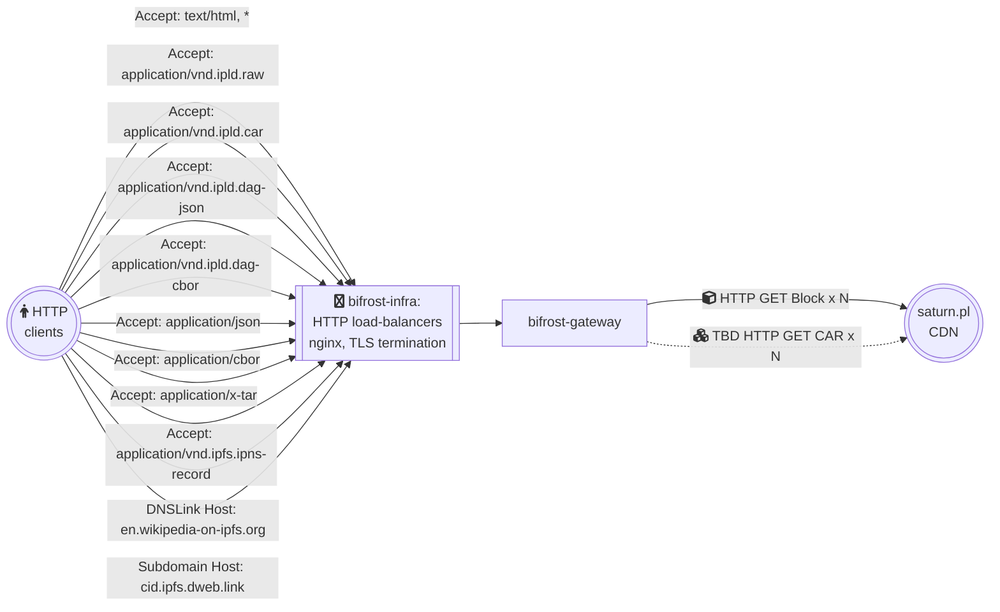

bifrost-gateway
=======================

> Gateway implementation used by [protocol/bifrost-infra](https://github.com/protocol/bifrost-infra)


## Usage

Local build:

```console
$ go build
$ ./bifrost-gateway --help
```

Prebuild Docker image:

```console
$ docker pull ipfs/bifrost-gateway:main-latest
$ docker run --rm -it --net=host ipfs/bifrost-gateway:main-latest --help
```

List of available revisions: https://hub.docker.com/r/ipfs/bifrost-gateway/tags

### How to debug?

See [`GOLOG_LOG_LEVEL`](./docs/environment-variables.md#golog_log_level).

## Configuration

See `./bifrost-gateway --help` and [`./docs/environment-variables.md`](./docs/environment-variables.md)

## Documentation

- HTTP Gateway implementation: [go-libipf/gateway](https://github.com/ipfs/go-libipfs/tree/main/gateway#readme)
- IPFS backend provided by: [Project Rhea (decentralized IPFS gateway)](https://pl-strflt.notion.site/Project-Rhea-decentralized-IPFS-gateway-3d5906e7a0d84bea800d5920005dfea6)

## Goals

This repository provides implementation of HTTP gateway capable of serving requests to:
- [path gateway](https://docs.ipfs.tech/how-to/address-ipfs-on-web/#path-gateway) at `ipfs.io`
- [subdomain gateway](https://docs.ipfs.tech/how-to/address-ipfs-on-web/#subdomain-gateway) at `dweb.link` 
- [selected DNSLink websites](https://github.com/protocol/bifrost-infra/blob/b6f85a54fddf1c21a966f8d5e5a3e31f54ad5431/ansible/inventories/bifrost/group_vars/collab_cluster.yml#L140-L271) on their own domain names.

This includes deserialized flat files, and special response types like verifiable Block/CAR.

## High level design




- IPFS Gateway interface based on reference implementation from [go-libipfs/gateway](https://github.com/ipfs/go-libipfs/tree/main/gateway#readme).
- IPFS Backend based on https://strn.network and HTTP client talking to it  via [caboose](https://github.com/filecoin-saturn/caboose) or something else.
- Functional gaps facilitated by temporary delegation to legacy Kubo RPC `(/api/v0`) infra already used by js-ipfs (or dedicated one).


## Lead Maintainer

- IPFS Stewards

## Contributing

Contributions are welcome! This repository is part of the IPFS project and therefore governed by our [contributing guidelines](https://github.com/ipfs/community/blob/master/CONTRIBUTING.md).

## License

[SPDX-License-Identifier: Apache-2.0 OR MIT](LICENSE.md)
