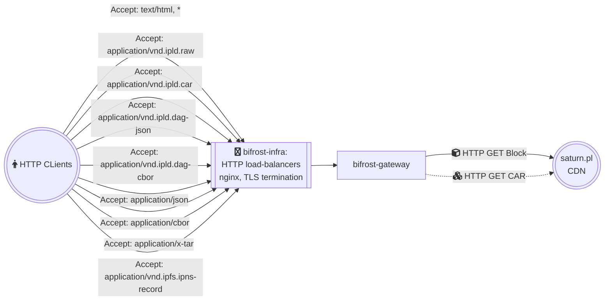

bifrost-gateway
=======================

> Gateway implementation used by [protocol/bifrost-infra](https://github.com/protocol/bifrost-infra)

## Documentation

- public: [go-libipf/gateway](https://github.com/ipfs/go-libipfs/tree/main/gateway#documentation)
- internal: [project rhea @ notion.so/pl-strflt](https://www.notion.so/pl-strflt/Project-Rhea-decentralized-IPFS-gateway-3d5906e7a0d84bea800d5920005dfea6#a432e575bf9b43ecb6a9619f0d90e948)

## Goals

This repository provides implementation of HTTP gateway capable of serving requests to:
- [path gateway](https://docs.ipfs.tech/how-to/address-ipfs-on-web/#path-gateway) at `ipfs.io`
- [subdomain gateway](https://docs.ipfs.tech/how-to/address-ipfs-on-web/#subdomain-gateway) at `dweb.link` 
- [selected DNSLink websites](https://github.com/protocol/bifrost-infra/blob/b6f85a54fddf1c21a966f8d5e5a3e31f54ad5431/ansible/inventories/bifrost/group_vars/collab_cluster.yml#L140-L271) on their own domain names.

This includes deserialized flat files, and special response types like verifiable Block/CAR.

## High level design

- IPFS Gateway interface based on reference implementation from [go-libipfs/gateway](https://github.com/ipfs/go-libipfs/tree/main/gateway#readme)
- IPFS Backend based on https://strn.network
- Functional gaps facilitated by temporary delegation to legacy Kubo RPC `(/api/v0`) infra already used by js-ipfs.

## Open problem

## Lead Maintainer

- IPFS Stewards for now, long term plan to hand over to Bifrost/Saturn (TBD)

## Contributing

Contributions are welcome! This repository is part of the IPFS project and therefore governed by our [contributing guidelines](https://github.com/ipfs/community/blob/master/CONTRIBUTING.md).

## License

[SPDX-License-Identifier: Apache-2.0 OR MIT](LICENSE.md)
